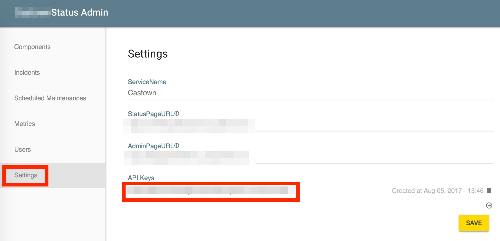
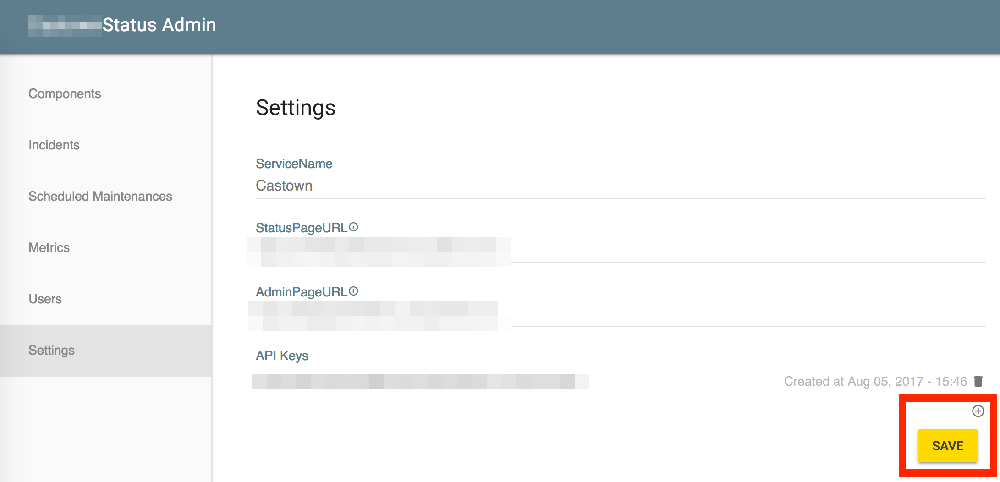

# Introduction

LambStatus provides a simple and powerful REST API, which enables you to:

* create and update components and incidents
* submit data points of your monitoring system's metrics
* ...

<aside class="notice">Note that the API is v0 and in the experimental status. Feel free to <a href="https://github.com/ks888/LambStatus/issues/new">open a new issue</a> for feature requests!</aside>

# API Endpoint

Your API endpoint is same as your admin page url. By default, it's something like `xxxxxxxxxxxxxx.cloudfront.net`.

# Authentication

> All the API calls look something like this:

```shell
curl "https://<your_api_endpoint>/api/..."
  -H "x-api-key: <your_api_key>"
```

> Make sure to replace `<your_api_endpoint>` and `<your_api_key>`.

The API uses API keys to allow access to the API. The "Settings" page of your admin page shows you one or more API keys:

   

If there is no key, create a new one by clicking the "+" icon and then the "SAVE" button.

   

The API expects for the API key to be included in all API requests to the server in a header that looks like the following:

`x-api-key: your_api_key`

# Rate Limiting

Each API token is limited to 10 requests / second.

# Components

## List Components

```shell
curl "https://<your_api_endpoint>/api/v0/components" \
  -H "x-api-key: <your_api_key>"
```

> The above command returns JSON structured like this:

```json
[
  {
    "componentID": "the_component_id",
    "name": "Website",
    "description": "",
    "status": "Operational",
    "order": 1509676878
  },
  ...
]
```

This endpoint retrieves all components.

### HTTP Request

`GET https://<your_api_endpoint>/api/v0/components`

## Create a New Component

```shell
curl -X POST "https://<your_api_endpoint>/api/v0/components" \
  -d '{"name":"Website", "description":"", "status":"Operational"}' \
  -H "x-api-key: <your_api_key>" -H "Content-Type: application/json"
```

> The above command returns JSON structured like this:

```json
{
  "componentID": "aKR6rTg0aW2d",
  "name": "Website",
  "description": "",
  "status": "Operational",
  "order": 1509676878
}
```

This endpoint create a new component.

### HTTP Request

`POST https://<your_api_endpoint>/api/v0/components`

### Parameters

Parameter | Description
--------- | -----------
name | The component name
description | The description of the component
status | The current status of the component. Must be one of `Operational`, `Under Maintenance`, `Degraded Performance`, `Partial Outage` and `Major Outage`.

## Update the Component

```shell
curl -X PATCH "https://<your_api_endpoint>/api/v0/components/<your_component_id>" \
  -d '{"status":"Major Outage"}' \
  -H "x-api-key: <your_api_key>" -H "Content-Type: application/json"
```

> The above command returns JSON structured like this:

```json
{
  "componentID": "aKR6rTg0aW2d",
  "name": "Website",
  "description": "",
  "status": "Major Outage",
  "order": 1509676878
}
```

This endpoint update the component.

### HTTP Request

`PATCH https://<your_api_endpoint>/api/v0/components/{componentid}`

### Parameters

Parameter | Description
--------- | -----------
componentid | The component id
name | The component name
description | The description of the component
status | The current status of the component. Must be one of `Operational`, `Under Maintenance`, `Degraded Performance`, `Partial Outage` and `Major Outage`.

## Delete the component

```shell
curl -X DELETE "https://<your_api_endpoint>/api/v0/components/<your_component_id>" \
  -H "x-api-key: <your_api_key>"
```

> The above command returns 204 No Content.

This endpoint deletes the component.

### HTTP Request

`DELETE https://<your_api_endpoint>/api/v0/components/{componentid}`

### Parameters

Parameter | Description
--------- | -----------
componentid | The component id

# Metrics

## Submit data points

```shell
curl -X POST "https://<your_api_endpoint>/api/v0/metrics/data" \
  -d '{
    "<your_metric_id>": [
      {"timestamp": "2017-06-05T00:00:00.000Z", "value": 1},
      {"timestamp": "2017-06-05T00:01:00.000Z", "value": 2}
    ]
  }' \
  -H "x-api-key: <your_api_key>" -H "Content-Type: application/json"
```

> The above command returns JSON structured like this:

```json
{
  "ARzfSNr5lb3G":[
    {"timestamp": "2017-11-03T00:00:00.000Z", "value": 1},
    {"timestamp": "2017-11-03T00:01:00.000Z", "value": 2}
  ]
}
```

> The response body is the ACTUAL values saved in the storage. So some data points may be omitted and the second part of a timestamp may be discarded.

If the metric is "Self" type, you can submit data points via this endpoint. See [the wiki](https://github.com/ks888/LambStatus/wiki/The-usage-of-%22Self%22-type-metrics) to start using the "Self" type metric.

### HTTP Request

`POST https://<your_api_endpoint>/api/v0/metrics/data`

### Parameters

Parameter | Description
--------- | -----------
\<your_metric_id\> | The metric ID
timestamp | The timestamp of the data point. The second and millisecond parts of the timestamp is discarded. For example, the timestamp `2017-06-05T11:11:11.111Z` is saved as `2017-06-05T11:11:00.000Z`
value | The data point value.

<aside class="notice">The data points are saved by the minutes. If there are multiple points in one minute, only the latest point is saved.</aside>
<aside class="notice">The number of data points per request must be equal to or less than 3000.</aside>

# Errors

> One or more errors will be returned in the following format:

```json
{
  "errors": [
    {"message": "message describing condition"},
    ...
  ]
}
```

Actionable failure conditions are reported as part of 4xx responses, in a json response body.

